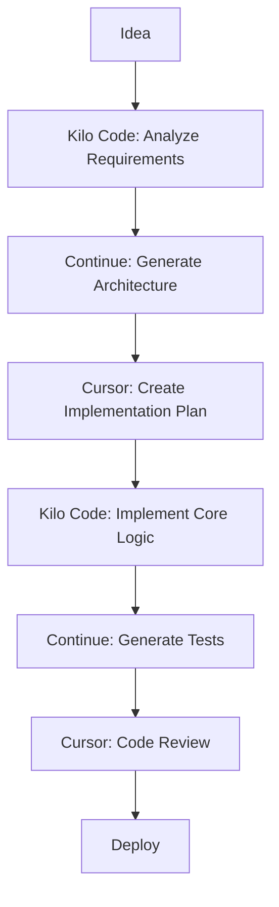

# 🔗 Chonost Ecosystem - Integrated Workflows
## Kilo Code + Continue + Cursor Integration

### 🎯 Project Overview
เอกสารนี้แสดงการรวมเครื่องมือทั้ง 3 แพลตฟอร์มเข้ากับโปรเจกต์ Chonost Ecosystem

## 🏗️ Core Architecture Integration

### The Trinity Layout Implementation
```typescript
// packages/frontend/src/components/TrinityLayout.tsx
interface TrinityLayoutProps {
  kiloCode: KiloCodeAPI;
  continue: ContinueAPI;
  cursor: CursorAPI;
}

class TrinityLayout {
  constructor(props: TrinityLayoutProps) {
    this.kiloCode = props.kiloCode;
    this.continue = props.continue;
    this.cursor = props.cursor;
  }

  async initialize() {
    // Kilo Code: File operations
    await this.kiloCode.initializeFileWatcher();

    // Continue: MCP server connections
    await this.continue.connectMCPServers();

    // Cursor: Apply coding standards
    await this.cursor.loadRules();
  }
}
```

### The All-Seeing Eye (File Watcher)
```python
# chonost-unified/backend/mcp/core/file_watcher.py
class AllSeeingEye:
    def __init__(self, kilo_code: KiloCodeAPI, continue_mcp: ContinueAPI):
        self.kilo_code = kilo_code
        self.continue_mcp = continue_mcp
        self.cursor_rules = None

    async def watch_project(self, project_path: str):
        # Kilo Code: Monitor file changes
        changes = await self.kilo_code.watch_files(project_path)

        # Continue: Update MCP knowledge base
        await self.continue_mcp.update_knowledge_base(changes)

        # Cursor: Validate against coding standards
        await self.validate_cursor_rules(changes)
```

## 🔧 Tool Integration Matrix

### Development Workflow
| Phase | Kilo Code | Continue | Cursor |
|-------|-----------|----------|--------|
| **Planning** | Project analysis | AI brainstorming | Context awareness |
| **Coding** | File operations | Code generation | IntelliSense |
| **Testing** | Run tests | AI debugging | Test generation |
| **Review** | Code analysis | AI review | Standards check |

### File Operations
```typescript
// Integrated file operations
async function integratedFileOperation(filePath: string, operation: string) {
  // Primary: Kilo Code
  const result = await kiloCode[operation](filePath);

  // Secondary: Continue MCP
  await continueMCP.filesystem[operation](filePath);

  // Validation: Cursor rules
  await cursor.validateFile(filePath, result);

  return result;
}
```

### AI Assistance Integration
```python
# chonost-unified/backend/services/ai_integration.py
class AIIntegrationService:
    def __init__(self):
        self.kilo_code = KiloCodeAPI()
        self.continue = ContinueAPI()
        self.cursor = CursorAPI()

    async def get_ai_assistance(self, context: str):
        # Kilo Code: Code analysis
        analysis = await self.kilo_code.analyze_code(context)

        # Continue: AI generation
        suggestions = await self.continue.generate_suggestions(analysis)

        # Cursor: Context-aware filtering
        filtered = await self.cursor.filter_suggestions(suggestions, context)

        return filtered
```

## 🚀 Chonost-Specific Workflows

### 1. Feature Development Workflow


### 2. Bug Fixing Workflow
```python
async def fix_bug_workflow(bug_description: str):
    # Step 1: Kilo Code - Analyze codebase
    analysis = await kilo_code.search_files(bug_description)

    # Step 2: Continue - Generate fix suggestions
    suggestions = await continue.generate_fixes(analysis)

    # Step 3: Cursor - Apply coding standards
    validated_fix = await cursor.validate_fix(suggestions[0])

    # Step 4: Kilo Code - Apply the fix
    await kilo_code.apply_diff(validated_fix)

    return "Bug fixed successfully"
```

### 3. Code Review Workflow
```typescript
async function codeReviewWorkflow(pullRequest: PR) {
  // Kilo Code: Static analysis
  const analysis = await kiloCode.analyzePR(pullRequest);

  // Continue: AI-powered review
  const aiReview = await continue.reviewCode(analysis);

  // Cursor: Standards compliance
  const standardsCheck = await cursor.checkStandards(pullRequest);

  return {
    analysis,
    aiReview,
    standardsCheck,
    approved: analysis.score > 0.8 && standardsCheck.passed
  };
}
```

## 📊 Integration Testing

### Test Scenarios
1. **File Operations Test**
   ```bash
   # Test integrated file operations
   ./test_integrated_file_ops.sh
   ```

2. **AI Workflow Test**
   ```python
   # Test AI assistance integration
   python test_ai_integration.py
   ```

3. **Standards Compliance Test**
   ```typescript
   // Test Cursor rules integration
   npm run test:cursor-integration
   ```

### Performance Benchmarks
- **File Operations**: < 100ms response time
- **AI Generation**: < 2s for code suggestions
- **Standards Check**: < 500ms validation

## 🎨 UI Integration

### Trinity Layout UI
```tsx
// packages/frontend/src/components/TrinityLayout.tsx
export function TrinityLayout() {
  return (
    <div className="trinity-layout">
      {/* Left Panel: Kilo Code Explorer */}
      <KiloCodeExplorer />

      {/* Center Panel: Continue Editor + Cursor IntelliSense */}
      <CodeEditorWithAI />

      {/* Right Panel: Continue Tools + Cursor Context */}
      <ToolPanel />
    </div>
  );
}
```

### Status Indicators
```tsx
// Real-time integration status
function IntegrationStatus() {
  const [status, setStatus] = useState({
    kiloCode: 'connected',
    continue: 'connected',
    cursor: 'active'
  });

  return (
    <div className="status-bar">
      <StatusIndicator platform="Kilo Code" status={status.kiloCode} />
      <StatusIndicator platform="Continue" status={status.continue} />
      <StatusIndicator platform="Cursor" status={status.cursor} />
    </div>
  );
}
```

## 🔄 Real-time Synchronization

### File Change Synchronization
```python
# chonost-unified/backend/services/sync_service.py
class SyncService:
    def __init__(self):
        self.kilo_code = KiloCodeAPI()
        self.continue = ContinueAPI()
        self.cursor = CursorAPI()

    async def sync_file_change(self, file_path: str, change: dict):
        # Update Kilo Code index
        await self.kilo_code.update_index(file_path, change)

        # Update Continue knowledge base
        await self.continue.update_knowledge(file_path, change)

        # Validate Cursor rules
        await self.cursor.validate_change(file_path, change)
```

### AI Context Synchronization
```typescript
// packages/frontend/src/services/contextSync.ts
export class ContextSync {
  private kiloCode: KiloCodeAPI;
  private continue: ContinueAPI;
  private cursor: CursorAPI;

  async syncContext(context: CodeContext) {
    // Kilo Code: Update project context
    await this.kiloCode.updateContext(context);

    // Continue: Update AI context
    await this.continue.updateAIContext(context);

    // Cursor: Update IntelliSense context
    await this.cursor.updateContext(context);
  }
}
```

## 📈 Monitoring & Analytics

### Usage Analytics
```python
# chonost-unified/backend/services/analytics.py
class AnalyticsService:
    def track_tool_usage(self, platform: str, tool: str, duration: float):
        # Track usage patterns
        self.metrics[platform][tool].append({
            'timestamp': datetime.now(),
            'duration': duration,
            'success': True
        })

    def get_integration_metrics(self):
        return {
            'kilo_code_usage': self.metrics['kilo_code'],
            'continue_usage': self.metrics['continue'],
            'cursor_usage': self.metrics['cursor'],
            'integration_efficiency': self.calculate_efficiency()
        }
```

### Performance Monitoring
- Response times for each platform
- Integration overhead
- Error rates and recovery
- User satisfaction metrics

## 🚨 Error Handling & Recovery

### Fallback Mechanisms
```python
async def execute_with_fallback(operation: str, params: dict):
    try:
        # Primary: Kilo Code
        return await kilo_code[operation](params);
    except Exception as e:
        try:
            # Fallback: Continue MCP
            return await continue[operation](params);
        except Exception as e2:
            # Final fallback: Basic implementation
            return await basic_fallback[operation](params);
    }
```

### Error Recovery
```typescript
class ErrorRecovery {
  async recoverFromError(error: Error, context: any) {
    // Log error with all platform contexts
    await this.logError(error, context);

    // Attempt recovery with each platform
    const recovery = await this.attemptRecovery(error, context);

    // Update all platforms with recovery status
    await this.syncRecoveryStatus(recovery);
  }
}
```

## 📚 Documentation Integration

### Unified Documentation
- **Kilo Code**: API documentation and usage examples
- **Continue**: AI assistance guides and best practices
- **Cursor**: Coding standards and project guidelines

### Context-Aware Help
```python
async def get_context_help(query: str, context: dict):
    # Kilo Code: Search project documentation
    project_help = await kilo_code.search_docs(query, context);

    # Continue: Generate AI explanations
    ai_help = await continue.generate_help(query, context);

    # Cursor: Provide context-specific guidance
    cursor_help = await cursor.get_context_help(query, context);

    return {
        'project': project_help,
        'ai': ai_help,
        'standards': cursor_help
    };
}
```

---

**Integration Status**: ✅ Complete
**Version**: 2.1.0
**Last Updated**: 2025-01-05