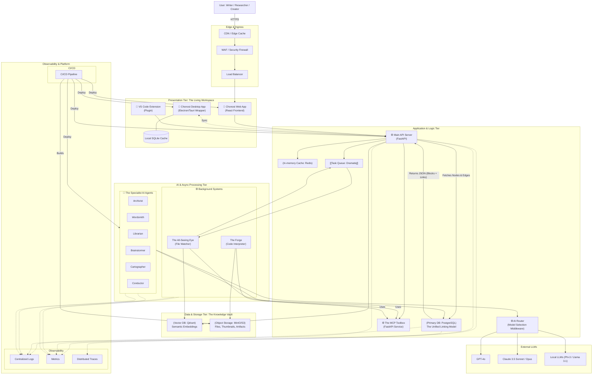

# **Chonost Encyclopedia**

---
**เวอร์ชัน:** 7.2 - The Foundational Chapter (with Dictionary Correction)
**สถานะ:** กำลังดำเนินการ (In Progress)

---

# **บทที่ 1: บทนำ, วิสัยทัศน์, และปรัชญาหลัก (Introduction, Vision, and Core Philosophy)**

## **1.1 บทนำ (Introduction)**

Chonost ไม่ได้ถูกสร้างขึ้นมาเพื่อเป็นเพียง "โปรแกรมแก้ไขข้อความ (Text Editor)" อีกหนึ่งตัวในตลาด แต่ถูกสร้างขึ้นในฐานะ **"ระบบนิเวศแห่งการสร้างสรรค์ (Creative Ecosystem)"** ที่ออกแบบมาเพื่อทลายกำแพงที่ขวางกั้นระหว่างเครื่องมือและกระบวนการคิดของผู้ใช้ เป้าหมายของ Chonost คือการเป็นพื้นที่ทำงานเดียวที่สามารถปรับเปลี่ยนรูปแบบได้ตามความคิดที่ลื่นไหลของมนุษย์ ตั้งแต่การร่างแนวคิดคร่าวๆ, การคิดเชิงโครงสร้าง, การเขียนเนื้อหา, ไปจนถึงการวิเคราะห์ข้อมูลที่ซับซ้อน

### **1.2 วิสัยทัศน์ (Vision)**

วิสัยทัศน์ของ Chonost คือการสร้าง **"เครื่องมือสำหรับนักคิด (A Tool for Thinkers)"** ที่ทรงพลังและชาญฉลาดที่สุด โดยเป็นเครื่องมือแรกที่สามารถหลอมรวม "โลกแห่งข้อความ (The World of Text)" และ "โลกแห่งภาพ (The World of Visuals)" ให้กลายเป็นหนึ่งเดียวกันได้อย่างสมบูรณ์แบบ เรามุ่งมั่นที่จะสร้างพื้นที่ทำงานที่ผู้ใช้ไม่รู้สึกถึงข้อจำกัดของซอฟต์แวร์ แต่รู้สึกเหมือนกำลังทำงานร่วมกับผู้ช่วยที่เข้าใจความคิดของตนเองอย่างแท้จริง

### **1.3 ปรัชญาหลัก (Core Philosophy)**

Chonost ถูกสร้างและขับเคลื่อนด้วยปรัชญาหลัก 3 ประการ ซึ่งเป็นเสมือน "กฎสามข้อ" ที่ชี้นำการตัดสินใจในการออกแบบทุกๆ ฟีเจอร์และทุกๆ ระบบ:

1. **ปรัชญาข้อที่ 1: ความคิดที่ลื่นไหล (Fluidity of Thought)**
    - **ความหมาย:** เครื่องมือต้องสามารถเปลี่ยนรูปแบบตามความคิดของผู้ใช้ได้ ไม่ใช่ให้ผู้ใช้ต้องฝืนเปลี่ยนกระบวนการคิดของตนเองให้เข้ากับข้อจำกัดของเครื่องมือ
    - **การนำไปใช้:** นำไปสู่การสร้างฟีเจอร์ **"The Living Workspace"** ที่ผู้ใช้สามารถสลับมุมมองระหว่าง Editor, Whiteboard, และ Graph View ได้อย่างอิสระและไร้รอยต่อ
2. **ปรัชญาข้อที่ 2: องค์ความรู้ที่เป็นหนึ่งเดียว (Unified Knowledge)**
    - **ความหมาย:** ข้อมูลทุกชิ้นในโปรเจกต์, ไม่ว่าจะเล็กหรือใหญ่, ต้องสามารถเชื่อมโยงถึงกันได้ และต้องสะท้อนให้เห็นภาพรวมของความสัมพันธ์ทั้งหมดในองค์ความรู้ของผู้ใช้
    - **การนำไปใช้:** นำไปสู่การสร้างระบบ **"The Unified Linking Model"** ที่ปฏิบัติต่อการเชื่อมโยงทุกรูปแบบ (ลิงก์, เส้นในแผนผัง, การกล่าวถึง) ว่าเป็นสิ่งเดียวกันในทางโครงสร้างข้อมูล
3. **ปรัชญาข้อที่ 3: ความฉลาดที่เรียกใช้ได้ (Intelligence on Demand)**
    - **ความหมาย:** พลังของปัญญาประดิษฐ์ (AI) ต้องพร้อมใช้งานในทุกระดับและทุกบริบท ตั้งแต่การช่วยเหลือเล็กๆ น้อยๆ ในการเขียน ไปจนถึงการวิเคราะห์ที่ซับซ้อน โดยต้องไม่รบกวนสมาธิหรือขั้นตอนการทำงานหลักของผู้ใช้
    - **การนำไปใช้:** นำไปสู่การออกแบบสถาปัตยกรรม **"The AI Trinity"** ที่แบ่ง AI ออกเป็น 3 ระดับ (Background, Inline, Assistant) เพื่อให้สามารถเรียกใช้ความสามารถของ AI ได้อย่างเหมาะสมและมีประสิทธิภาพสูงสุด

---

# **บทที่ 2: ระบบและสถาปัตยกรรมหลัก (Core Systems & Architecture)**
💡

**คำนิยาม:** ระบบเหล่านี้คือกลไกและสถาปัตยกรรมซอฟต์แวร์เบื้องหลังที่มองไม่เห็นด้วยตาเปล่า แต่เป็นรากฐานที่ทำให้ฟีเจอร์ทั้งหมดของ Chonost สามารถทำงานร่วมกันได้อย่างเป็นระบบและมีประสิทธิภาพ

</aside>

## **2.1 ระบบ: The Unified Linking Model (ระบบการเชื่อมโยงที่เป็นหนึ่งเดียว)**

- **หน้าที่หลัก:** ทำหน้าที่เป็น **"ฐานข้อมูลกลาง (Central Database)"** และ **"แหล่งความจริงหนึ่งเดียว (Single Source of Truth)"** สำหรับข้อมูลและความสัมพันธ์ทั้งหมดภายในโปรเจกต์
- **หลักการทำงาน:**
    1. **Node-Based Storage:** ข้อมูลทุกชิ้น ไม่ว่าจะเป็นเอกสาร, ย่อหน้า, ตัวละคร, หรือแนวคิด จะถูกจัดเก็บในรูปแบบของ **"โหนด (Nodes)"** ที่มี ID เฉพาะตัวและมี Metadata กำกับ
    2. **Edge-Based Relations:** ความสัมพันธ์ทุกรูปแบบระหว่างโหนด จะถูกจัดเก็บเป็น **"เส้นเชื่อม (Edges)"** ที่มีคุณสมบัติกำกับ เช่น `type` (ประเภทความสัมพันธ์), `is_explicit` (ความชัดเจน), และ `strength` (ความแข็งแกร่ง)
    3. **Decoupling Data from Presentation:** ระบบนี้จะแยก "ข้อมูลดิบ" ออกจาก "วิธีการแสดงผล" อย่างเด็ดขาด ทำให้ข้อมูลชุดเดียวกันสามารถถูกนำไปแสดงผลได้หลากหลายรูปแบบ
- **เทคโนโลยีที่เกี่ยวข้อง:** PostgreSQL (สำหรับจัดเก็บ Nodes และ Edges), Database Schema Design

## **2.2 ระบบ: The Content Renderer Engine (ระบบการแสดงผลอัจฉริยะ)**

- **หน้าที่หลัก:** ทำหน้าที่เป็น **"เครื่องยนต์การแสดงผล (Rendering Engine)"** ในฝั่ง Frontend ที่รับผิดชอบการแปลงข้อมูลดิบจาก The Unified Linking Model ให้กลายเป็นสิ่งที่ผู้ใช้มองเห็นและโต้ตอบได้บนหน้าจอ
- **หลักการทำงาน:**
    1. **Block-based Rendering:** ระบบจะอ่านข้อมูลในเอกสารทีละ "บล็อก"
    2. **Component Mapping:** จากนั้นจะตรวจสอบ `type` ของแต่ละบล็อก (เช่น `paragraph`, `heading`, `mermaid_diagram`) แล้วส่งข้อมูลนั้นไปให้ "React Component" ที่ถูกสร้างขึ้นมาเพื่อแสดงผลข้อมูลประเภทนั้นๆ โดยเฉพาะ
    3. **Contextual Rendering:** สามารถกำหนดค่าให้ Engine นี้แสดงผล Component ชุดหนึ่งใน "Editor View" และแสดงผลอีกชุดหนึ่งใน "Chat Panel" ได้ เพื่อให้เหมาะสมกับบริบทการใช้งาน
- **เทคโนโลยีที่เกี่ยวข้อง:** React, TypeScript, Component-based Architecture

### กลไกการดึงข้อมูล (Data Fetching Mechanism)

เมื่อผู้ใช้เปิดเอกสารใน The Living Workspace, The Content Renderer Engine จะส่งคำขอ (API Request) ไปยัง Main API Server พร้อมกับ `document_id` ของเอกสารที่ต้องการ จากนั้น Main API Server จะเข้าไปสืบค้นข้อมูลจาก The Unified Linking Model (PostgreSQL) โดยดึง 2 ส่วนหลัก:

1. Nodes: บล็อกข้อมูล (Content Blocks) ทั้งหมดของเอกสารนั้น เรียงตามลำดับ
2. Edges: ความสัมพันธ์ (Links) ทั้งหมดที่เริ่มต้นหรือสิ้นสุดภายในเอกสารนั้น

Main API Server จะรวบรวมเป็น JSON ที่มีโครงสร้างชัดเจน แล้วส่งกลับมาให้ The Content Renderer Engine เพื่อนำไปทำ Block-based Rendering ต่อไป

<aside>
🧩

**สรุปย่อ Data Fetching:** Renderer เรียก Main API Server ด้วย `document_id` จากนั้นเซิร์ฟเวอร์ดึง <strong>Nodes</strong> และ <strong>Edges</strong> จาก The Unified Linking Model แล้วรวมเป็น JSON โครงสร้างชัดเจน เพื่อให้ทำ <em>Block-based Rendering</em> ได้ทันที

</aside>

### **2.3 ระบบ: The All-Seeing Eye (ระบบจัดทำดัชนีอัตโนมัติ)**

- **หน้าที่หลัก:** ทำหน้าที่เป็น **"ระบบการรับรู้และจัดทำดัชนี (Perception & Indexing System)"** ที่ทำงานเบื้องหลังตลอดเวลา เพื่อให้ฐานข้อมูลกลาง (The Unified Linking Model) และคลังข้อมูลสำหรับการค้นหา (Vector Store) เป็นปัจจุบันเสมอ
- **หลักการทำงาน:**
    1. **File System Watching:** ใช้ไลบรารี `watchdog` เพื่อตรวจจับทุกการเปลี่ยนแปลงของไฟล์ในโปรเจกต์ (สร้าง, แก้ไข, ลบ)
    2. **Task Queuing:** เมื่อตรวจพบการเปลี่ยนแปลง จะส่ง "งาน (Task)" เข้าไปในระบบคิว (Task Queue) เพื่อป้องกันไม่ให้การประมวลผลหนักๆ มากระทบกับการทำงานหลักของผู้ใช้
    3. **Indexing Pipeline:** "Worker" ที่ทำงานเบื้องหลังจะดึงงานออกจากคิว แล้วนำเนื้อหาที่เปลี่ยนแปลงไปผ่านกระบวนการต่างๆ เช่น การสกัด Entity, การสร้าง Embeddings, และการอัปเดตฐานข้อมูล Nodes/Edges และ Vector Store
- **เทคโนโลยีที่เกี่ยวข้อง:** Watchdog (File Watching), Dramatiq/Celery (Task Queue), Redis (Broker), Sentence-Transformers (Embeddings)

### **2.4 ระบบ: The MCP Toolbox (ระบบจัดการเครื่องมือและสะพานเชื่อม)**

- **หน้าที่หลัก:** ทำหน้าที่เป็น **"เซิร์ฟเวอร์จัดการเครื่องมือ (Tool Management Server)"** ที่เป็นมาตรฐานกลางและเป็นจุดเชื่อมต่อเดียว (Single Gateway) สำหรับการเรียกใช้ "เครื่องมือ (Tools)" ทั้งหมดในระบบ
- **หลักการทำงาน:**
    1. **Tool Registration:** เครื่องมือทุกชิ้น (เช่น `file.create`, `google_search`, `db.query`) จะถูก "ลงทะเบียน" ไว้กับ MCP Server พร้อมคำอธิบายและพารามิเตอร์ที่ต้องการ
    2. **Standardized API:** AI Agents หรือระบบอื่นๆ ที่ต้องการใช้เครื่องมือ จะไม่เรียกใช้ฟังก์ชันโดยตรง แต่จะส่งคำขอที่เป็นมาตรฐาน (ตามโปรโตคอล MCP) ไปยัง MCP Server
    3. **Execution & Security:** MCP Server จะทำหน้าที่ตรวจสอบสิทธิ์, เรียกใช้ฟังก์ชันที่ผูกกับเครื่องมือนั้นๆ, และส่งผลลัพธ์กลับไปอย่างปลอดภัย
- **เทคโนโลยีที่เกี่ยวข้อง:** Model Context Protocol (MCP), FastAPI (สำหรับสร้าง Server), OpenAPI/JSON Schema (สำหรับนิยาม Tools)

### การสื่อสารระหว่างระบบเบื้องหลัง (Inter-System Communication)

<aside>
💡

เพื่อคงหลักการแยกส่วน (Decoupling) ระบบเบื้องหลังอย่าง The All-Seeing Eye และ The Forge จะไม่สื่อสารกันโดยตรง แต่สื่อสารผ่าน “คนกลาง” คือ The MCP Toolbox และ Task Queue ตามลำดับเหตุการณ์ตัวอย่าง:

</aside>

1) ผู้ใช้สั่งงานใน The Forge ให้ "อ่านไฟล์ทั้งหมดในโปรเจกต์และสร้างไฟล์สรุปผล"

2) สคริปต์ใน The Forge เรียกใช้เครื่องมือผ่าน MCP เช่น `file.list_all()` แทนการแตะไฟล์โดยตรง

3) เมื่อสร้างไฟล์สรุปผลแล้วบันทึกลงโปรเจกต์

4) The All-Seeing Eye ตรวจพบไฟล์ใหม่และส่งงานเข้า Task Queue เพื่อทำ Index

5) Worker ทำ Indexing ปรับปรุง Nodes/Edges และ Vector Store ให้เป็นปัจจุบัน

---

### **2.5 ระบบ: The Synchronization Engine (ระบบการซิงค์ข้อมูลข้ามแพลตฟอร์ม)**

- **แนวคิด:** Cloud-First with Offline Capabilities โดย Single Source of Truth อยู่ที่ฐานข้อมูลบนคลาวด์ แต่ Desktop App ทำงานออฟไลน์ได้
- **หลักการทำงาน:**
    1. Local Caching: Desktop App (Tauri) มีฐานข้อมูลฝังตัว เช่น SQLite สำหรับแคชข้อมูลที่เข้าถึงบ่อย
    2. Initial Sync: เปิดแอปครั้งแรกจะดึงข้อมูลที่จำเป็นมาเก็บในแคชท้องถิ่น
    3. Offline Mode: ไม่มีอินเทอร์เน็ต แอปจะอ่าน/เขียนกับแคชท้องถิ่นโดยอัตโนมัติ
    4. Delta Syncing: เมื่อออนไลน์ จะเทียบความต่างและส่งเฉพาะส่วนที่เปลี่ยนแปลง เพื่อลดทราฟฟิกและเพิ่มความเร็ว
    5. Conflict Resolution: หากแก้ไขชนกันระหว่างเว็บกับเดสก์ท็อป ระบบจะแจ้งผู้ใช้ให้เลือกเวอร์ชันหรือรวมเวอร์ชันอัตโนมัติ
- **การเปลี่ยนแปลงในไดอะแกรม:** เพิ่ม (Local SQLite Cache) ใน DesktopApp และเส้นเชื่อมแบบสองทิศทาง DesktopApp <-> APIServer พร้อมป้ายกำกับ Sync

### **2.6 ระบบ: Tauri Application Shell (การหุ้มเว็บแอปภายในเอกสาร)**

- **หน้าที่หลัก:** ใช้ **Tauri** เพื่อหุ้มเว็บแอปให้ทำงานเป็นแอปเดสก์ท็อปน้ำหนักเบา และสามารถ "ฝังเว็บแอป" ลงในหน้าเอกสารได้โดยตรงอย่างปลอดภัยและลื่นไหล
- **หลักการทำงาน:**
    1. **WebView Embedding:** แสดงเว็บแอปภายในบล็อกเนื้อหาเหมือนวิดเจ็ต ผู้ใช้สามารถโต้ตอบได้เต็มรูปแบบ ทั้งใน Editor และ Whiteboard View
    2. **Secure Bridge:** ใช้ **Tauri Commands** เป็นสะพานสื่อสารระหว่าง UI (WebView) กับระบบปฏิบัติการ และจำกัดสิทธิ์ด้วย allowlist เพื่อความปลอดภัย
    3. **Resource Sandboxing:** จำกัดการเข้าถึงไฟล์ ระบบเครือข่าย และคำสั่งที่อ่อนไหว ด้วยการกำหนด scope และ permission ชัดเจน
    4. **Offline-first:** บันเดิล asset สำคัญสำหรับการทำงานออฟไลน์ และซิงก์เมื่อออนไลน์อีกครั้ง
    5. **Tooling Integration:** เว็บแอปที่ฝังสามารถเรียกใช้เครื่องมือผ่าน **The MCP Toolbox** ได้ โดยผ่านอินเตอร์เฟซมาตรฐาน
- **การฝังในเอกสาร (Authoring UX):**
    - เพิ่มบล็อกชนิด “Embedded Web App” แล้วระบุ URL หรือเลือกจากรายการเว็บแอปที่อนุมัติไว้
    - ตั้งค่าขนาด กรอบ และสิทธิ์ที่ต้องใช้ เช่น เครือข่าย หรือการเข้าถึงไฟล์เฉพาะโฟลเดอร์
    - รองรับโหมดโฟกัสแบบเต็มพื้นที่ใน Whiteboard เพื่อใช้งานอินเทอร์แอคทีฟอย่างเต็มที่
- **เทคโนโลยีที่เกี่ยวข้อง:** Tauri, Rust, WebView, Tauri Commands, Scoped FS Access (การหุ้มเว็บแอปภายในเอกสาร)

<aside>
💡

- **หน้าที่หลัก:** ใช้ **Tauri** เพื่อหุ้มเว็บแอปให้ทำงานเป็นแอปเดสก์ท็อปน้ำหนักเบา และสามารถ "ฝังเว็บแอป" ลงในหน้าเอกสารได้โดยตรงอย่างปลอดภัยและลื่นไหล
</aside>

- **หลักการทำงาน:**
    1. **WebView Embedding:** แสดงเว็บแอปภายในบล็อกเนื้อหาเหมือนวิดเจ็ต ผู้ใช้สามารถโต้ตอบได้เต็มรูปแบบ ทั้งใน Editor และ Whiteboard View
    2. **Secure Bridge:** ใช้ **Tauri Commands** เป็นสะพานสื่อสารระหว่าง UI (WebView) กับระบบปฏิบัติการ และจำกัดสิทธิ์ด้วย allowlist เพื่อความปลอดภัย
    3. **Resource Sandboxing:** จำกัดการเข้าถึงไฟล์ ระบบเครือข่าย และคำสั่งที่อ่อนไหว ด้วยการกำหนด scope และ permission ชัดเจน
    4. **Offline-first:** บันเดิล asset สำคัญสำหรับการทำงานออฟไลน์ และซิงก์เมื่อออนไลน์อีกครั้ง
    5. **Tooling Integration:** เว็บแอปที่ฝังสามารถเรียกใช้เครื่องมือผ่าน **The MCP Toolbox** ได้ โดยผ่านอินเตอร์เฟซมาตรฐาน
- **การฝังในเอกสาร (Authoring UX):**
    - เพิ่มบล็อกชนิด “Embedded Web App” แล้วระบุ URL หรือเลือกจากรายการเว็บแอปที่อนุมัติไว้
    - ตั้งค่าขนาด กรอบ และสิทธิ์ที่ต้องใช้ เช่น เครือข่าย หรือการเข้าถึงไฟล์เฉพาะโฟลเดอร์
    - รองรับโหมดโฟกัสแบบเต็มพื้นที่ใน Whiteboard เพื่อใช้งานอินเทอร์แอคทีฟอย่างเต็มที่
- **เทคโนโลยีที่เกี่ยวข้อง:** Tauri, Rust, WebView, Tauri Commands, Scoped FS Access

---

# **บทที่ 3: ฟีเจอร์และประสบการณ์ผู้ใช้ (Features & User Experience) - (ฉบับแก้ไข)**

- **คำนิยาม:** ฟีเจอร์ในบทนี้คือ "สิ่งที่ผู้ใช้มองเห็น, สัมผัส, และใช้งานโดยตรง" มันคือผลลัพธ์จากการทำงานร่วมกันของ "ระบบ" ต่างๆ ในบทที่ 2 เพื่อสร้างประสบการณ์การใช้งานที่เป็นเอกลักษณ์ของ Chonost

### **3.1 ฟีเจอร์หลัก (Core Features)**

- **คำนิยาม:** ฟีเจอร์ที่เป็นหัวใจสำคัญของประสบการณ์ผู้ใช้ ถ้าขาดไป Chonost จะสูญเสียเอกลักษณ์และความสามารถในการแข่งขันไปอย่างสิ้นเชิง
    - **3.1.1 ฟีเจอร์: The Living Workspace (พื้นที่ทำงานที่มีชีวิต)**
        - **คำอธิบาย:** ประสบการณ์หลักที่ผู้ใช้สามารถทำงานกับข้อมูลชุดเดียวกันผ่านมุมมองที่แตกต่างกัน 3 รูปแบบหลัก คือ **Editor View**, **Whiteboard View**, และ **Graph View** ได้อย่างลื่นไหลและเชื่อมโยงถึงกัน
        - **ระบบที่เกี่ยวข้อง:** The Content Renderer Engine, The Unified Linking Model
    - **3.1.2 ฟีเจอร์: The Command & Control System (ระบบสั่งการและควบคุม)**
        - **คำอธิบาย:** ช่องทางหลักที่ผู้ใช้ใช้ในการสั่งงานและควบคุมโปรแกรมทั้งหมด ทำให้เข้าถึงทุกฟังก์ชันได้อย่างรวดเร็วและเป็นธรรมชาติ
        - **ระบบที่เกี่ยวข้อง:** The MCP Toolbox (เบื้องหลังการจัดการคำสั่ง)

### **3.2 ฟีเจอร์รอง (Supporting Features) - (ฉบับแก้ไข)**

- **คำนิยาม:** ฟีเจอร์ที่สนับสนุนและเพิ่มความสามารถให้กับฟีเจอร์หลัก ทำให้การทำงานมีความฉลาด ทรงพลัง และสะดวกสบายมากยิ่งขึ้น
    - **3.2.1 ฟีเจอร์: The Forge (โรงตีเหล็ก - Code Interpreter)**
        - **คำอธิบาย:** พื้นที่สำหรับผู้ใช้ระดับสูงในการเขียนและรันโค้ด Python เพื่อทำงานเฉพาะทาง เช่น การวิเคราะห์ข้อมูล การสร้างภาพ หรือการสร้างระบบอัตโนมัติส่วนตัว
        - **ระบบที่เกี่ยวข้อง:** The MCP Toolbox (สำหรับเรียกใช้เครื่องมือ), Docker (สำหรับ Sandbox)
    - **3.2.2 ฟีเจอร์: The Knowledge Explorer (เครื่องมือสำรวจองค์ความรู้)**
        - **คำอธิบาย:** แผงควบคุมใน Left Sidebar ที่ให้ผู้ใช้สามารถสำรวจ "Nodes" และ "Edges" ทั้งหมดในโปรเจกต์ได้ ทำให้มองเห็นภาพรวมขององค์ความรู้ทั้งหมด
        - **ระบบที่เกี่ยวข้อง:** The Unified Linking Model (เป็นแหล่งข้อมูล)
    - **3.2.3 ฟีเจอร์ : The Living Dictionary & Doc Reference (พจนานุกรมมีชีวิตและคลังอ้างอิง)**
        - **คำอธิบาย:** "ส่วนขยาย" ที่ทรงพลังของ The Knowledge Explorer ไม่ใช่แค่พจนานุกรมธรรมดา แต่เป็น **"สารานุกรมส่วนตัวของโปรเจกต์"** ที่ผู้ใช้สามารถ "สนทนา" ด้วยได้
        - **หลักการทำงาน:** เมื่อเปิดใช้งาน จะทำหน้าที่เป็น Interface สำหรับ The RAG Engine โดยตรง ผู้ใช้พิมพ์คำค้นหาหรือคำถามเกี่ยวกับ "แนวคิด", "ตัวละคร", หรือ "สถานที่" ใดๆ ในโปรเจกต์ จากนั้นระบบใช้ Semantic Search เพื่อดึงข้อมูลที่เกี่ยวข้องจากทุกไฟล์ มาสรุปและตอบ พร้อมลิงก์อ้างอิงไปยังเอกสารต้นฉบับ
        - **ระบบที่เกี่ยวข้อง:** The RAG Engine, The Unified Linking Model
    - **3.2.4 ฟีเจอร์: The Assistant Panel (แผงผู้ช่วย AI)**
        - **คำอธิบาย:** พื้นที่สนทนาใน Right Sidebar สำหรับพูดคุย ระดมสมอง และสั่งงาน AI ในเชิงลึก โดยแตกต่างจาก Living Dictionary ที่เน้นการ "ค้นหาและอ้างอิง" ข้อมูลที่มีอยู่แล้ว
        - **ระบบที่เกี่ยวข้อง:** The AI Trinity (เป็นผู้ขับเคลื่อน)

### **3.3 ฟีเจอร์ย่อย (Granular Features) - (ฉบับแก้ไข)**

- **คำนิยาม:** ฟีเจอร์ที่เป็นส่วนประกอบย่อยของฟีเจอร์ที่ใหญ่กว่า หรือเป็นฟังก์ชันเฉพาะทางที่ช่วยเสริมประสบการณ์การใช้งานให้สมบูรณ์
    - **3.3.1 ฟีเจอร์: The Rotary Palettes (วงล้อเครื่องมือ)**
        - **เป็นส่วนหนึ่งของ:** The Command & Control System
        - **คำอธิบาย:** UI แบบวงล้อ 2 ฝั่ง (ซ้าย-Contextual, ขวา-Global) ที่เป็นช่องทางหนึ่งในการเข้าถึงคำสั่งต่างๆ
    - **3.3.2 ฟีเจอร์: The Command Palette (แผงคำสั่ง)**
        - **เป็นส่วนหนึ่งของ:** The Command & Control System
        - **คำอธิบาย:** หน้าต่างคีย์ลัด (`Ctrl/Cmd + P`) เพื่อค้นหาและเรียกใช้ทุกคำสั่งในระบบ
    - **3.3.3 ฟีเจอร์: The Seamless Switch (การสลับมุมมองไร้รอยต่อ)**
        - **เป็นส่วนหนึ่งของ:** The Living Workspace
        - **คำอธิบาย:** กลไกและปุ่มที่ใช้ในการสลับระหว่าง Editor View และ Whiteboard View
    - **3.3.4 ฟีเจอร์: The Unified Graph View (มุมมองกราฟที่เป็นหนึ่งเดียว)**
        - **เป็นส่วนหนึ่งของ:** The Living Workspace
        - **คำอธิบาย:** มุมมองที่แสดงผลความสัมพันธ์ทั้งหมดจาก The Unified Linking Model ในรูปแบบของกราฟ
    - **3.3.5 ฟีเจอร์: Semantic Search (การค้นหาเชิงความหมาย)**
        - **เป็นส่วนหนึ่งของ:** The Knowledge Explorer และ **The Living Dictionary**
        - **คำอธิบาย:** ความสามารถในการค้นหาโดยใช้ภาษาธรรมชาติ เพื่อหาข้อมูลที่ "เกี่ยวข้อง" แม้จะไม่มี Keyword ตรงกันทุกคำ
        - **ระบบที่เกี่ยวข้อง:** The RAG Engine

### **3.4 ฟีเจอร์พื้นฐาน (Standard Features)**

- **คำนิยาม:** ฟังก์ชันพื้นฐานที่ผู้ใช้คาดหวังว่าจะมีในโปรแกรมประเภทนี้ ซึ่ง Chonost มีให้ครบถ้วน
    - **3.4.1 File and Project Management:** การจัดการไฟล์ โฟลเดอร์ และโปรเจกต์
    - **3.4.2 Advanced Text Editing:** รองรับ Markdown การจัดรูปแบบ การค้นหาและแทนที่
    - **3.4.3 Import/Export:** รองรับการนำเข้าและส่งออกไฟล์ในรูปแบบมาตรฐาน (MD, PDF, DOCX)
    - **3.4.4 User Settings and Customization:** หน้าต่างการตั้งค่าโปรแกรม ธีม และ API Keys
    - **3.4.5 Cross-Platform Support:** สามารถทำงานได้บน Windows macOS และ Linux

---

# **บทที่ 4: ปัญญาประดิษฐ์และทีมงาน Agent ผู้เชี่ยวชาญ (Artificial Intelligence & The Specialist Agent Team)**

- **คำนิยาม:** บทนี้จะอธิบายถึง "จิตสำนึก" และ "กระบวนการคิด" ทั้งหมดของ Chonost โดยจะเจาะลึกถึงสถาปัตยกรรม AI, รายชื่อ Agent ผู้เชี่ยวชาญแต่ละตัว, หน้าที่ความรับผิดชอบ, กลไกการทำงาน, และโมเดลภาษาขนาดใหญ่ (LLM) ที่ถูกเลือกใช้ในแต่ละภารกิจ

### **4.1 สถาปัตยกรรมหลัก: The AI Trinity (หลักการสามประสาน)**

- **แนวคิด:** "ใช้คนที่ถูกกับงาน" เพื่อสร้างสมดุลระหว่าง **ประสิทธิภาพ (Performance)**, **ความแม่นยำ (Accuracy)**, และ **ต้นทุน (Cost)**
- **หลักการทำงาน:** เป็นโครงสร้างองค์กรของทีม AI ที่แบ่งการทำงานออกเป็น 3 ระดับ:
    1. **Background (เบื้องหลัง):** ทำงานตลอดเวลา, ใช้ทรัพยากรน้อย, เน้นความเร็ว, ใช้โมเดลขนาดเล็กที่ทำงานบนเครื่องผู้ใช้ (Local) หรือโมเดล Cloud ที่เร็วที่สุด
    2. **Inline (ในบรรทัด):** ทำงานเมื่อถูกเรียกใช้, ต้องการความเร็วในการตอบสนอง, ใช้โมเดลขนาดกลางที่สมดุลระหว่างความเร็วและความสามารถ
    3. **Assistant (ผู้ช่วย):** ทำงานในแผงควบคุม, ต้องการความสามารถในการให้เหตุผล (Reasoning) สูงสุด, ใช้โมเดลที่ทรงพลังที่สุดแม้จะมีต้นทุนสูงกว่า

### **4.2 การเลือกใช้โมเดลภาษาขนาดใหญ่ (LLM Selection Strategy)**

- **แนวคิด:** Chonost ใช้สถาปัตยกรรมแบบ **"Multi-Model"** และมี **"AI Router"** อัจฉริยะเป็นตัวกลางในการเลือกโมเดลที่เหมาะสมที่สุดสำหรับแต่ละภารกิจ
- **รายชื่อโมเดลที่ใช้และเหตุผล:**
    - **Local/Fast Model (สำหรับ Background & Simple Inline Tasks):**
        - **โมเดล:** `Phi-3-mini` หรือ `Llama-3.1-8B` (Quantized Version)
        - **เหตุผล:** มีขนาดเล็กพอที่จะรันบนเครื่องผู้ใช้ได้ (ผ่าน ONNX/WebGPU), ตอบสนองเร็วมาก, และเก่งในงานที่ไม่ซับซ้อน เช่น การสกัด Entity หรือการเดาคำ
    - **Balanced Model (สำหรับ Inline & Quick Assistant Tasks):**
        - **โมเดล:** `Claude 3.5 Sonnet`
        - **เหตุผล:** เป็นโมเดลที่มีความสามารถในการให้เหตุผลสูงมากในราคาที่คุ้มค่าที่สุด (Price/Performance Ratio ดีเยี่ยม) เหมาะสำหรับงานสรุป, แปลงโครงสร้าง, และตอบคำถามที่ไม่ซับซ้อนมาก
    - **Powerful Model (สำหรับ Deep Analysis & Creative Tasks):**
        - **โมเดล:** `GPT-4o` หรือ `Claude 3 Opus`
        - **เหตุผล:** เป็นโมเดลที่ทรงพลังที่สุดในตลาด มีความสามารถในการให้เหตุผลเชิงลึก, การคิดหลายขั้นตอน, และการสร้างสรรค์เนื้อหาที่ซับซ้อน เหมาะสำหรับงานวิเคราะห์พล็อตหรือระดมสมอง

### **4.3 ทีมงาน Agent ผู้เชี่ยวชาญ (The Specialist Agent Team)**

- **คำนิยาม:** นี่คือ "พนักงาน" แต่ละคนในทีม AI ของเรา พวกเขาถูกสร้างขึ้นโดยใช้ **OpenAI Agents SDK** (หรือเฟรมเวิร์กที่เทียบเท่า) และมีหน้าที่, เครื่องมือ, และโมเดลที่ได้รับมอบหมายอย่างชัดเจน

### **Agent 1: The Archivist (นักจดหมายเหตุ)**

- **ระดับ:** Background
- **ถูกเรียกใช้ที่ไหน:** ทำงานอัตโนมัติเมื่อระบบ **The All-Seeing Eye** ตรวจพบการเปลี่ยนแปลงในเอกสาร
- **ทำงานอย่างไร:**
    1. รับ "ข้อความที่เปลี่ยนแปลง" มาเป็น Input
    2. เรียกใช้ **Local/Fast Model (`Phi-3-mini`)** เพื่อสกัดหา Entities (ชื่อคน, สถานที่) และตรวจจับ Unlinked Mentions
    3. ส่งผลลัพธ์ที่ได้ไปให้ **The MCP Toolbox** เพื่อเรียกใช้เครื่องมือ `database.add_node` และ `database.add_edge`
- **โมเดลที่ใช้:** `Phi-3-mini` (เน้นความเร็วและต้นทุนต่ำสุด)

### **Agent 2: The Wordsmith (นักเล่นแร่แปรธาตุทางภาษา)**

- **ระดับ:** Inline
- **ถูกเรียกใช้ที่ไหน:** เมื่อผู้ใช้เลือกข้อความใน Editor แล้วเรียกใช้คำสั่งจาก **The Command & Control System** (เช่น คลิกขวา -> "สรุปย่อ" หรือใช้ Rotary Palette)
- **ทำงานอย่างไร:**
    1. รับ "ข้อความที่เลือก" และ "คำสั่ง" (เช่น `summarize`, `rephrase`) มาเป็น Input
    2. เรียกใช้ **Balanced Model (`Claude 3.5 Sonnet`)** เพื่อประมวลผลตามคำสั่ง
    3. ส่งผลลัพธ์กลับไปแสดงผลใน UI เพื่อให้ผู้ใช้ยืนยันการเปลี่ยนแปลง
- **โมเดลที่ใช้:** `Claude 3.5 Sonnet` (สมดุลระหว่างความเร็วและความสามารถในการเขียน)

### **Agent 3: The Cartographer (นักเขียนแผนที่)**

- **ระดับ:** Inline / Assistant
- **ถูกเรียกใช้ที่ไหน:** เมื่อผู้ใช้พิมพ์ `/mermaid` ใน Editor หรือสั่งผ่าน Assistant Chat ว่า "สร้างแผนผัง..."
- **ทำงานอย่างไร (Self-Correcting Loop):**
    1. รับ "Prompt" หรือ "ข้อมูลที่มีโครงสร้าง" มาเป็น Input
    2. **(Step 1)** เรียกใช้ **Balanced Model (`Claude 3.5 Sonnet`)** ซึ่งมีความคิดสร้างสรรค์ ให้แปลง Prompt เป็น "โค้ด Mermaid"
    3. **(Step 2)** นำโค้ดที่ได้ไปทดลอง Render ในสภาพแวดล้อมจำลอง (Headless Rendering)
    4. **(Step 3)** หาก Render สำเร็จ -> ส่งโค้ดให้ผู้ใช้ หากล้มเหลว -> นำ "Error Message" ที่ได้ไปเป็น Input ใหม่ แล้วเรียกใช้ **Powerful Model (`GPT-4o`)** ซึ่งเก่งด้านการ Debugging ให้ "แก้ไขโค้ด"
    5. วนกลับไป Step 2 จนกว่าจะสำเร็จหรือครบ 3 รอบ
- **โมเดลที่ใช้:** `Claude 3.5 Sonnet` (สำหรับสร้างสรรค์) และ `GPT-4o` (สำหรับแก้ไข)

### **Agent 4: The Librarian (บรรณารักษ์ - RAG Specialist)**

- **ระดับ:** Assistant
- **ถูกเรียกใช้ที่ไหน:** เมื่อผู้ใช้ถามคำถามใน **The Assistant Panel** หรือใช้ **The Living Dictionary**
- **ทำงานอย่างไร:**
    1. รับ "คำถาม" ของผู้ใช้มาเป็น Input
    2. เรียกใช้ **Balanced Model (`Claude 3.5 Sonnet`)** เพื่อแปลงคำถามให้เป็น "Embedding Vector" และสกัดหา Keywords
    3. ส่ง Vector และ Keywords ไปให้ **The MCP Toolbox** เพื่อเรียกใช้เครื่องมือ `vector_store.semantic_search` และ `database.keyword_search`
    4. รวบรวม "Context" ที่เกี่ยวข้องที่สุดที่ได้กลับมา
    5. สร้าง Prompt ใหม่ที่ประกอบด้วย "คำถามเดิม + Context ที่หามาได้" แล้วส่งให้ **Powerful Model (`GPT-4o`)** เพื่อ "สังเคราะห์คำตอบ" พร้อมอ้างอิงแหล่งที่มา
- **โมเดลที่ใช้:** `Claude 3.5 Sonnet` (สำหรับ Query Processing) และ `GPT-4o` (สำหรับสังเคราะห์คำตอบ)

### **Agent 5: The Brainstormer (นักระดมสมอง)**

- **ระดับ:** Assistant
- **ถูกเรียกใช้ที่ไหน:** เมื่อผู้ใช้สนทนาปลายเปิดใน **The Assistant Panel** (เช่น "ช่วยคิดพล็อตเรื่องหน่อย", "ตัวละครนี้ควรมีจุดอ่อนอะไรดี?")
- **ทำงานอย่างไร:**
    1. รับ "Prompt" ที่ต้องการความคิดสร้างสรรค์จากผู้ใช้
    2. สามารถเรียกใช้เครื่องมือ `google_search` ผ่าน **The MCP Toolbox** เพื่อหาแรงบันดาลใจจากภายนอกได้
    3. ส่ง Prompt ทั้งหมดไปให้ **Powerful Model (`GPT-4o` หรือ `Claude 3 Opus`)** ซึ่งเป็นโมเดลที่มีความสามารถในการสร้างสรรค์สูงสุด
- **โมเดลที่ใช้:** `GPT-4o` หรือ `Claude 3 Opus` (เน้นความสามารถในการสร้างสรรค์สูงสุด)

### **Agent 6: The Conductor (วาทยกร - Meta-Agent)**

- **ระดับ:** Assistant (Meta-Level)
- **ถูกเรียกใช้ที่ไหน:** ทำงานเบื้องหลังใน **The Assistant Panel** เมื่อได้รับคำสั่งที่ซับซ้อนและต้องใช้ Agent หลายตัวทำงานร่วมกัน
- **ทำงานอย่างไร:**
    1. รับ "เป้าหมายสุดท้าย" ของผู้ใช้มาเป็น Input (เช่น "วิเคราะห์ตัวละคร Arion แล้วสร้างแผนผังความสัมพันธ์")
    2. เรียกใช้ **Powerful Model (`GPT-4o`)** เพื่อ "วางแผน (Plan)" ว่าต้องทำอะไรบ้างเป็นลำดับขั้นตอน (เช่น 1. เรียก Librarian เพื่อหาข้อมูล Arion, 2. เรียก Brainstormer เพื่อวิเคราะห์ความสัมพันธ์, 3. เรียก Cartographer เพื่อสร้างแผนผัง)
    3. จากนั้นจะทำหน้าที่เป็น "ผู้จัดการโปรเจกต์" คอยเรียกใช้ Agent แต่ละตัวตามแผน และนำผลลัพธ์จาก Agent หนึ่งไปเป็น Input ให้อีก Agent หนึ่งจนกว่างานจะเสร็จสมบูรณ์
- **โมเดลที่ใช้:** `GPT-4o` (ต้องการความสามารถในการวางแผนและให้เหตุผลขั้นสูงสุด)

---

# **บทที่ 5: แรงบันดาลใจและสายเลือดทางเทคโนโลยี (Inspirations and Technological Lineage)**

- **คำนิยาม:** บทนี้จัดทำขึ้นเพื่อเป็นการให้เกียรติและบันทึกถึงแนวคิด, ปรัชญา, และเทคโนโลยีจากโปรแกรมและแหล่งข้อมูลต่างๆ ที่เป็นแรงบันดาลใจสำคัญในการสร้างสรรค์ Chonost มันคือแผนที่ที่แสดงให้เห็นว่าเราสืบทอด "DNA" มาจากใคร และนำมาต่อยอดและวิวัฒนาการไปในทิศทางใด

### **5.1 แรงบันดาลใจด้านปรัชญาและประสบการณ์ผู้ใช้ (Philosophy & UX Inspirations)**

- **5.1.1 แหล่งที่มา:** [Obsidian.md](http://Obsidian.md)
    - **แนวคิดที่ได้รับ:**
        - **The Knowledge Graph:** ปรัชญาของการมองเห็นความเชื่อมโยงของข้อมูลทั้งหมดเป็นภาพกราฟ
        - **Bi-directional Linking:** แนวคิดเรื่อง Backlinks และการเชื่อมโยงสองทิศทาง
        - **Local-First & Plain Text:** ความเชื่อมั่นในการให้ผู้ใช้เป็นเจ้าของข้อมูลของตนเองอย่างแท้จริงผ่านไฟล์ Markdown
        - **Extensibility via Plugins:** สถาปัตยกรรมที่เปิดให้มีการสร้างส่วนเสริมเพื่อขยายความสามารถได้อย่างไร้ขีดจำกัด
    - **Chonost ต่อยอดอย่างไร:** เรานำแนวคิด Knowledge Graph มายกระดับด้วย **The Unified Linking Model** ที่ทำให้เส้นในกราฟมีความหมายและประเภทที่หลากหลายมากขึ้น และทำให้การเชื่อมโยงเกิดขึ้นได้หลายมิติ (Text ↔ Visual)
- **5.1.2 แหล่งที่มา:** [Notion.so](http://Notion.so)
    - **แนวคิดที่ได้รับ:**
        - **Everything is a Block:** ปรัชญาการมองว่าทุกองค์ประกอบในหน้าเอกสารคือ "บล็อก" ที่สามารถเคลื่อนย้ายและแปลงประเภทได้
        - **Database-driven Pages:** ความสามารถในการสร้างฐานข้อมูลที่ทรงพลังและแสดงผลได้หลายรูปแบบ (Table, Board, Calendar)
    - **Chonost ต่อยอดอย่างไร:** เรานำแนวคิด "Everything is a Block" มาผสานกับ **The Content Renderer Engine** เพื่อให้มีความยืดหยุ่นในการแสดงผลที่ซับซ้อนยิ่งกว่า และนำแนวคิด Database มาทำให้เป็นส่วนหนึ่งของเนื้อหาทั้งหมดผ่าน **The Unified Linking Model** แทนที่จะเป็นแค่บล็อกประเภทหนึ่ง
- **5.1.3 แหล่งที่มา:** [Craft.do](http://Craft.do)
    - **แนวคิดที่ได้รับ:**
        - **Aesthetic & Fluid User Interface:** การออกแบบ UI ที่สวยงาม, ลื่นไหล, และให้ความรู้สึกที่ดีในการใช้งาน
        - **Contextual Menus & Tooling:** การแสดงเครื่องมือที่จำเป็นขึ้นมาในบริบทที่ถูกต้อง ทำให้หน้าจอไม่รก
        - **Seamless Document Nesting:** การสร้างเอกสารซ้อนในเอกสารได้อย่างเป็นธรรมชาติ
    - **Chonost ต่อยอดอย่างไร:** เราได้รับแรงบันดาลใจในการออกแบบ **The Rotary Palettes** และ **The Trinity Layout** มาจากปรัชญาของ Craft ที่เน้นความเรียบง่ายและทรงพลังในเวลาเดียวกัน
- **5.1.4 แหล่งที่มา: Apple Numbers & PencilKit**
    - **แนวคิดที่ได้รับ:**
        - **Infinite Canvas:** แนวคิดของ "ผืนผ้าใบที่ไม่มีที่สิ้นสุด" ที่ผู้ใช้สามารถวางวัตถุ (ตาราง, ข้อความ, รูปภาพ) ได้อย่างอิสระ
        - **Direct Manipulation:** การที่ผู้ใช้สามารถโต้ตอบกับข้อมูลได้โดยตรง (เช่น การลากเพื่อสร้างความสัมพันธ์ระหว่างเซลล์)
    - **Chonost ต่อยยอดอย่างไร:** เรานำแนวคิด Infinite Canvas มาใช้ใน **Whiteboard View** และนำปรัชญา Direct Manipulation มาเป็นหัวใจของการออกแบบ **The Unified Linking Model** ที่การกระทำบนภาพส่งผลต่อข้อความ และในทางกลับกัน

### **5.2 สายเลือดทางเทคโนโลยีและสถาปัตยกรรม (Technology & Architectural Lineage)**

- **5.2.1 แหล่งที่มา: OpenAI (GPT series, Agents SDK)**
    - **เทคโนโลยีที่ได้รับ:**
        - **Large Language Models (LLMs):** ความสามารถในการเข้าใจและสร้างภาษาของมนุษย์
        - **Agents SDK / Function Calling:** สถาปัตยกรรมที่ทำให้ LLM สามารถเรียกใช้ "เครื่องมือ" ภายนอกได้อย่างเป็นระบบ
    - **Chonost ต่อยอดอย่างไร:** เราไม่ได้ใช้ LLM เป็นแค่ Chatbot แต่เราสร้าง **"ทีมงาน The Specialist AI Agents"** ขึ้นมาโดยใช้สถาปัตยกรรม Agents SDK เป็นแกนหลัก และสร้าง **The MCP Toolbox** ขึ้นมาเป็นชั้นของการจัดการเครื่องมือที่เหนือกว่า
- **5.2.2 แหล่งที่มา: Jupyter Notebook / Project Jupyter**
    - **เทคโนโลยีที่ได้รับ:**
        - **Kernel Architecture:** สถาปัตยกรรมที่แยก "การประมวลผล (Kernel)" ออกจาก "ส่วนติดต่อผู้ใช้ (UI)"
        - **Interactive Computing:** แนวคิดของการรันโค้ดทีละเซลล์และเห็นผลลัพธ์ได้ทันที
    - **Chonost ต่อยยอดอย่างไร:** เรานำสถาปัตยกรรม Kernel มาสร้างเป็น **The Forge (Code Interpreter)** แต่ทำให้มันทรงพลังยิ่งขึ้นโดยการให้ Kernel สามารถเข้าถึงองค์ความรู้ทั้งหมดในโปรเจกต์ผ่าน **The MCP Toolbox** ได้
- **5.2.3 แหล่งที่มา: Visual Studio Code (VS Code)**
    - **เทคโนโลยีที่ได้รับ:**
        - **Command Palette (`Ctrl/Cmd + P`):** สุดยอด UI สำหรับ Power User ในการเข้าถึงทุกคำสั่ง
        - **Language Server Protocol (LSP):** สถาปัตยกรรมมาตรฐานสำหรับการสร้างเครื่องมือที่เข้าใจภาษาโปรแกรมต่างๆ
    - **Chonost ต่อยอดอย่างไร:** เรานำ **Command Palette** มาเป็นหัวใจของ **The Command & Control System** และใช้ปรัชญาของ LSP ในการออกแบบให้ AI Agents สามารถ "เข้าใจ" บริบทของข้อมูลที่กำลังทำงานอยู่ได้
- **5.2.4 แหล่งที่มา: The Open Source Community**
    - **เทคโนโลยีที่ได้รับ:** เรายืนอยู่บนไหล่ของยักษ์ใหญ่ในโลกโอเพนซอร์สมากมาย อาทิ:
        - **React & FastAPI:** สำหรับการสร้างเว็บแอปพลิเคชันที่ทันสมัยและมีประสิทธิภาพ
        - **PostgreSQL & Redis:** สำหรับระบบฐานข้อมูลและ Caching ที่แข็งแกร่ง
        - **Docker:** สำหรับการสร้างสภาพแวดล้อมที่ปลอดภัยและทำซ้ำได้ (Sandboxing)
        - **Hugging Face Transformers & Sentence-Transformers:** สำหรับการเข้าถึงและใช้งานโมเดล AI บนเครื่องผู้ใช้
    - **Chonost ต่อยอดอย่างไร:** เรานำเครื่องมือเหล่านี้มา "ประกอบร่าง" กันภายใต้สถาปัตยกรรมที่เป็นเอกลักษณ์ของเรา เพื่อสร้างสิ่งที่เครื่องมือเดี่ยวๆ ไม่สามารถทำได้

---

# **บทที่ 6: แผนที่การพัฒนาและโครงสร้างโปรเจกต์ (Development Roadmap & Project Structure)**

- **คำนิยาม:** บทนี้คือแผนที่การเดินทางทั้งหมดของโปรเจกต์ Chonost โดยจะแสดงลำดับการพัฒนาฟีเจอร์ต่างๆ อย่างเป็นขั้นตอน (Phases) พร้อมทั้งอธิบายโครงสร้างของโค้ดและเทคโนโลยีที่ใช้ในแต่ละส่วน เพื่อให้ทีมพัฒนา (หรือตัวคุณเอง) มีภาพที่ชัดเจนในการลงมือปฏิบัติ

### **6.1 แผนที่การพัฒนา (Development Roadmap)**

- **Phase 1: Foundation & Core Infrastructure (เดือนที่ 1-2)**
    - **เป้าหมาย:** วางรากฐานทางเทคนิคที่แข็งแกร่งเพื่อรองรับ **The Unified Linking Model**
    - **งานหลัก:**
        - [x]  ตั้งค่า Monorepo, FastAPI Backend, React Frontend, Docker
        - [x]  ออกแบบและสร้าง Database Schema (PostgreSQL) สำหรับ `Nodes` และ `Edges`
        - [x]  สร้าง **Content Renderer Engine** พื้นฐานใน Frontend
        - [x]  สร้าง Logic การตรวจจับและสร้างลิงก์พื้นฐาน (`[[Link]]`)
- **Phase 2: The AI Trinity & The Knowledge Vault (เดือนที่ 3-4)**
    - **เป้าหมาย:** สร้าง "สมอง" และ "คลังสมอง" ของระบบ
    - **งานหลัก:**
        - [ ]  พัฒนา **AI Agents** ทั้ง 3 ระดับ (Background, Inline, Assistant)
        - [ ]  ติดตั้งและตั้งค่า **Vector Database (Qdrant)**
        - [ ]  สร้าง Indexing Pipeline สำหรับทำ RAG
        - [ ]  พัฒนา **Self-Correcting Mermaid Component**
- **Phase 3: The Living Workspace (เดือนที่ 5-6)**
    - **เป้าหมาย:** ทำให้พื้นที่ทำงานมีชีวิตชีวาและโต้ตอบได้ตาม **The Trinity Layout**
    - **งานหลัก:**
        - [ ]  สร้าง Layout 3 ส่วนหลัก (Left/Main/Right)
        - [ ]  พัฒนา **The Seamless Switch (Editor ↔ Whiteboard)** โดยใช้ Excalidraw
        - [ ]  พัฒนา **The Unified Graph View**
- **Phase 4: Advanced Automation & Integration (เดือนที่ 7-8)**
    - **เป้าหมาย:** ขยายความสามารถของ Chonost ให้เป็นแพลตฟอร์ม
    - **งานหลัก:**
        - [ ]  พัฒนา **The Forge (Code Interpreter)**
        - [ ]  พัฒนา **The MCP Toolbox** ให้สมบูรณ์
        - [ ]  เริ่มพัฒนา VS Code Extension
- **Phase 5: AI Model Integration & Optimization (เดือนที่ 9-10)**
    - **เป้าหมาย:** ทำให้ระบบ AI มีความยืดหยุ่นและประสิทธิภาพสูงสุด
    - **งานหลัก:**
        - [ ]  เชื่อมต่อกับ Azure LLM และ Local Models
        - [ ]  พัฒนา **AI Router** อัจฉริยะ
        - [ ]  ทำ Performance Optimization
- **Phase 6: Testing & Deployment (เดือนที่ 11-12)**
    - **เป้าหมาย:** ทำให้ระบบเสถียร, ปลอดภัย, และพร้อมใช้งานจริง
    - **งานหลัก:**
        - [ ]  เขียน Unit Tests และ Integration Tests
        - [ ]  ทดสอบตามสถานการณ์ **"The Ultimate Gauntlet"** และ **"The User's Journey"**
        - [ ]  เตรียม Production Deployment

### **6.2 โครงสร้างโปรเจกต์ (Project Structure - Monorepo)**

```
/chonost-project
├── /packages
│   ├── /frontend          # React + TypeScript App
│   │   ├── /src
│   │   │   ├── /components  # UI Components (Renderer, Palettes, etc.)
│   │   │   ├── /hooks       # Custom React Hooks
│   │   │   ├── /services    # API calling services
│   │   │   └── /store       # State Management (Zustand)
│   │   └── package.json
│   │
│   ├── /backend           # FastAPI App
│   │   ├── /src
│   │   │   ├── /api         # API Routes
│   │   │   ├── /core        # Core logic, settings
│   │   │   ├── /db          # Database models, migrations
│   │   │   ├── /agents      # AI Agent definitions
│   │   │   └── /services    # Business logic (Indexing, RAG, etc.)
│   │   └── requirements.txt
│   │
│   └── /shared            # โค้ดที่ใช้ร่วมกันระหว่าง Frontend และ Backend
│       └── /types         # TypeScript type definitions
│
├── /services              # Microservices ที่ทำงานแยกต่างหาก
│   ├── /mcp-toolbox       # MCP Server (FastAPI)
│   ├── /code-interpreter  # The Forge (Docker + Jupyter)
│   └── /file-watcher      # The All-Seeing Eye (Python script)
│
├── docker-compose.yml     # สำหรับรัน Services ทั้งหมด (Postgres, Redis, Qdrant)
└── package.json           # Root package.json สำหรับจัดการ Monorepo

```

---

## **ภาคผนวก (Appendix)**

### **A.1 รายการ Dependencies และเวอร์ชัน (Official Dependencies & Versions)**

- **คำนิยาม:** รายการไลบรารีและเฟรมเวิร์กทั้งหมดที่ใช้ในโปรเจกต์ พร้อมเวอร์ชันที่แน่นอนตามข้อมูลที่ได้รับล่าสุด นี่คือ "ความจริงหนึ่งเดียว" สำหรับสภาพแวดล้อมการพัฒนาของโปรเจกต์ Chonost

### **A.1.1 Frontend Dependencies (Node.js)**

| Package Name | Version |
| --- | --- |
| `@iconify-json/bxl` | 1.2.2 |
| `@iconify-json/devicon` | 1.2.42 |
| `@iconify-json/noto` | 1.2.6 |
| `@iconify-json/skill-icons` | 1.2.3 |
| `@iconify-json/token-branded` | 1.2.26 |
| `@iconify/react` | 6.0.0 |
| `mermaid` | 11.10.1 |

### **A.1.2 Backend Dependencies (Python)**

| Package Name | Version |
| --- | --- |
| `annotated-types` | 0.7.0 |
| `anyio` | 4.10.0 |
| `arabic-reshaper` | 3.0.0 |
| `asn1crypto` | 1.5.1 |
| `beautifulsoup4` | 4.13.4 |
| `blinker` | 1.9.0 |
| `brotli` | 1.1.0 |
| `certifi` | 2025.8.3 |
| `cffi` | 1.17.1 |
| `charset-normalizer` | 3.4.3 |
| `click` | 8.2.1 |
| `contourpy` | 1.3.3 |
| `cryptography` | 45.0.6 |
| `cssselect2` | 0.8.0 |
| `cycler` | 0.12.1 |
| `defusedxml` | 0.7.1 |
| `et-xmlfile` | 2.0.0 |
| **`fastapi`** | **0.116.1** |
| **`flask`** | **3.1.2** |
| `fonttools` | 4.59.1 |
| `fpdf` | 1.7.2 |
| `fpdf2` | 2.8.4 |
| `greenlet` | 3.2.4 |
| `h11` | 0.16.0 |
| `html5lib` | 1.1 |
| `idna` | 3.10 |
| `itsdangerous` | 2.2.0 |
| `jinja2` | 3.1.6 |
| `kiwisolver` | 1.4.9 |
| `lxml` | 6.0.1 |
| `markdown` | 3.8.2 |
| `markupsafe` | 3.0.2 |
| `matplotlib` | 3.10.5 |
| `narwhals` | 2.1.2 |
| **`numpy`** | **2.3.2** |
| `openpyxl` | 3.1.5 |
| `oscrypto` | 1.3.0 |
| `packaging` | 25.0 |
| **`pandas`** | **2.3.2** |
| `pdf2image` | 1.17.0 |
| `pillow` | 11.3.0 |
| `playwright` | 1.54.0 |
| `plotly` | 6.3.0 |
| `pycparser` | 2.22 |
| **`pydantic`** | **2.11.7** |
| `pydantic-core` | 2.33.2 |
| `pydyf` | 0.11.0 |
| `pyee` | 13.0.0 |
| `pyhanko` | 0.29.1 |
| `pyhanko-certvalidator` | 0.27.0 |
| `pyparsing` | 3.2.3 |
| `pypdf` | 6.0.0 |
| `pyphen` | 0.17.2 |
| `python-bidi` | 0.6.6 |
| `python-dateutil` | [2.9.0.post](http://2.9.0.post)0 |
| `pytz` | 2025.2 |
| `pyyaml` | 6.0.2 |
| `reportlab` | 4.4.3 |
| `requests` | 2.32.5 |
| `seaborn` | 0.13.2 |
| `six` | 1.17.0 |
| `sniffio` | 1.3.1 |
| `soupsieve` | 2.7 |
| `starlette` | 0.47.2 |
| `svglib` | 1.5.1 |
| `tabulate` | 0.9.0 |
| `tinycss2` | 1.4.0 |
| `tinyhtml5` | 2.0.0 |
| `tqdm` | 4.67.1 |
| `typing-extensions` | 4.14.1 |
| `typing-inspection` | 0.4.1 |
| `tzdata` | 2025.2 |
| `tzlocal` | 5.3.1 |
| `uritools` | 5.0.0 |
| `urllib3` | 2.5.0 |
| **`uvicorn`** | **0.35.0** |
| `weasyprint` | 66.0 |
| `webencodings` | 0.5.1 |
| `werkzeug` | 3.1.3 |
| `xhtml2pdf` | 0.2.17 |
| `zopfli` | [0.2.3.post](http://0.2.3.post) |

---

# Chonost Architecture Overview (Corrected Version)



## องค์ประกอบสำคัญ (Components at a glance) - ฉบับแก้ไข

### 🌟 **ส่วนแสดงผล (Presentation Tier) - ประตูสู่ Chonost**

- **Chonost Web App (React):** แอปพลิเคชันหลักที่ทำงานบนเบราว์เซอร์ เป็น Frontend ที่ผู้ใช้ส่วนใหญ่เข้าถึง
- **Chonost Desktop App (Electron/Tauri):** แอปพลิเคชันสำหรับติดตั้งบนเดสก์ท็อป (Windows, macOS, Linux) ซึ่งห่อหุ้ม Web App ไว้อีกที เพื่อให้สามารถทำงานกับไฟล์ในเครื่องได้โดยตรง
- **VS Code Extension:** ส่วนเสริมสำหรับโปรแกรม VS Code ที่ทำให้สามารถใช้ฟีเจอร์บางอย่างของ Chonost ได้โดยตรงจากใน Editor ของนักพัฒนา

### ⚙️ **ส่วนตรรกะแอปพลิเคชัน (Application & Logic Tier) - สมองส่วนกลาง**

- **Main API Server (FastAPI):** เซิร์ฟเวอร์หลักที่ทำหน้าที่เป็น "ประตูหลัง" รับคำขอทั้งหมดจาก Frontend, จัดการ Business Logic, และสื่อสารกับส่วนอื่นๆ
- **The MCP Toolbox (FastAPI Service):** "ท่าเรือ" จัดการเครื่องมือ ทำงานเป็น Microservice แยกต่างหาก เพื่อควบคุมการเข้าถึงเครื่องมือทั้งหมดอย่างเป็นระบบ
- **Cache (Redis) & Task Queue (Dramatiq):** ระบบสนับสนุนที่ช่วยเพิ่มความเร็วและจัดการงานเบื้องหลัง

### 🧠 **ส่วนปัญญาประดิษฐ์และประมวลผลเบื้องหลัง (AI & Async Processing Tier) - จิตวิญญาณของระบบ**

- **The Specialist AI Agents:** ทีมงาน AI 6+ ตัว ที่ทำงานเป็น Microservices แยกต่างหาก มีหน้าที่เฉพาะทางและเรียกใช้เครื่องมือผ่าน **The MCP Toolbox**
- **Background Systems:**
    - **The All-Seeing Eye:** ระบบจัดทำดัชนีอัตโนมัติ ทำงานเป็น Service แยกเพื่อคอย "มอง" การเปลี่ยนแปลงของไฟล์
    - **The Forge (Code Interpreter):** ระบบรันโค้ด Python ที่ทำงานเป็น Service แยกในสภาพแวดล้อมที่ปลอดภัย

### 🗄️ **ส่วนข้อมูลและคลังเก็บ (Data & Storage Tier) - ความทรงจำระยะยาว**

- **Primary DB (PostgreSQL):** ฐานข้อมูลหลักที่เก็บ **The Unified Linking Model** (`Nodes` และ `Edges`)
- **Vector DB (Qdrant):** ฐานข้อมูลเวกเตอร์สำหรับเก็บ Semantic Embeddings เพื่อการค้นหาเชิงความหมาย
- **Object Storage (MinIO/S3):** คลังเก็บไฟล์ขนาดใหญ่, รูปภาพ, และผลลัพธ์จาก The Forge

---