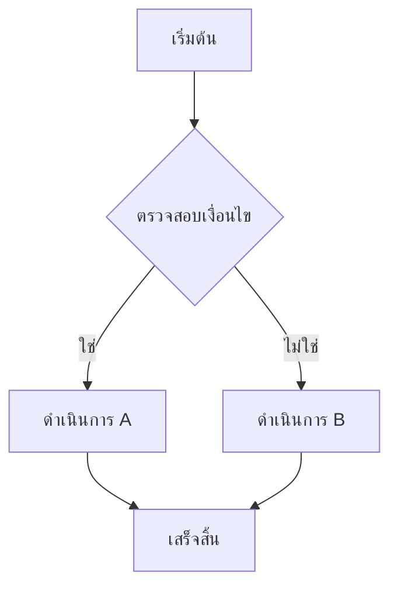
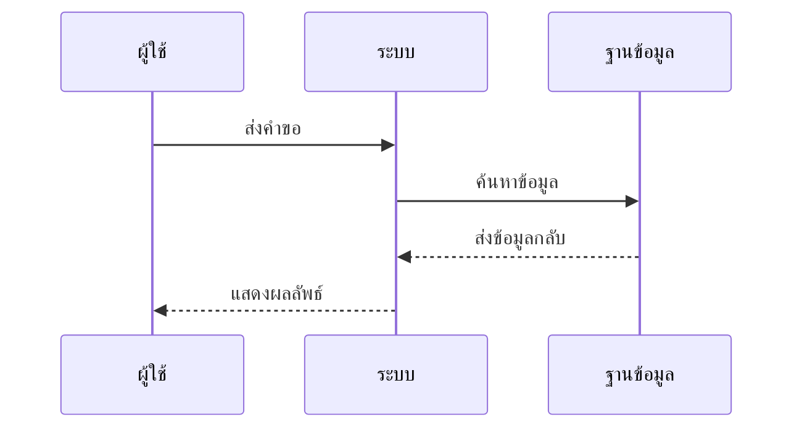
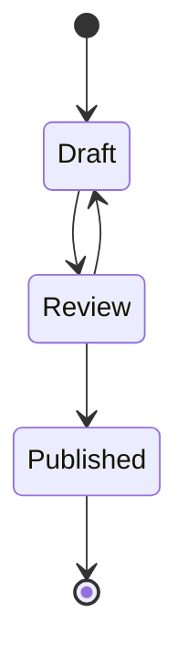
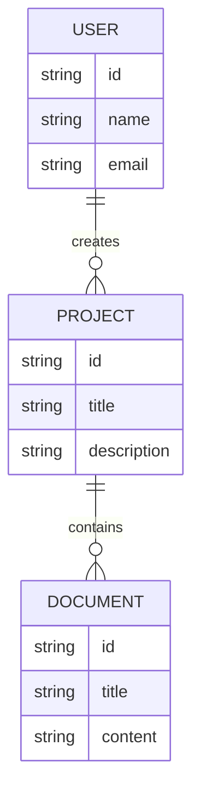
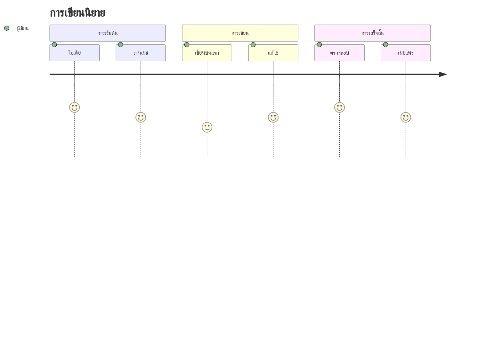
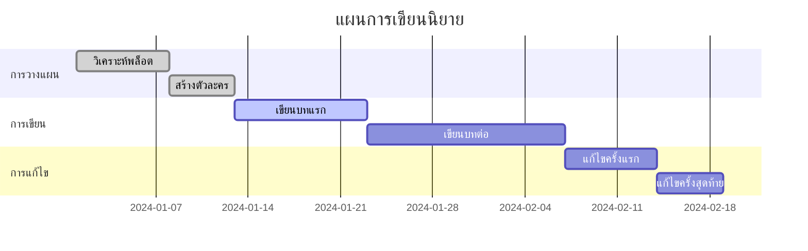
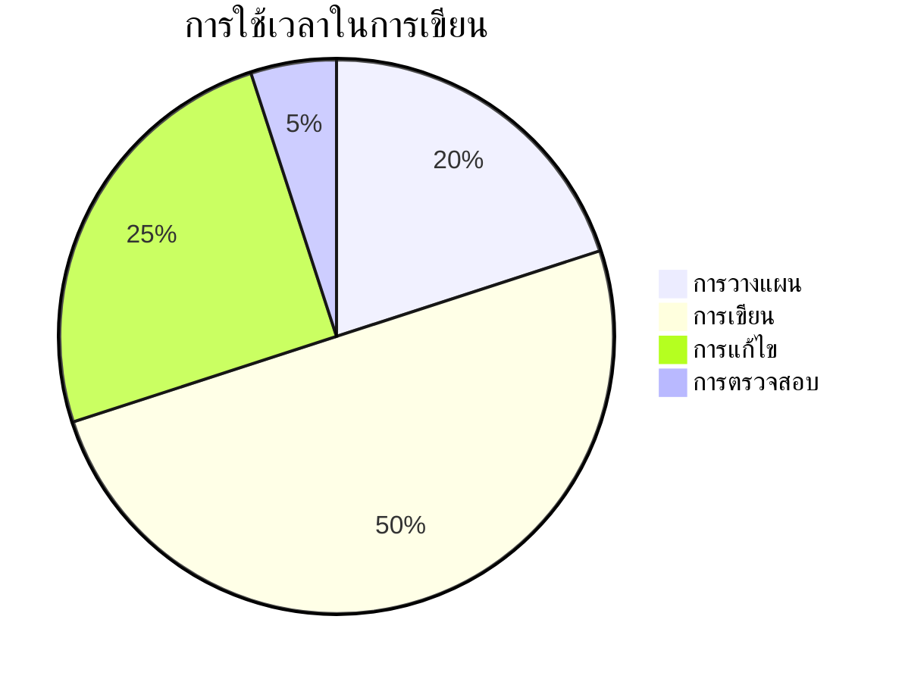
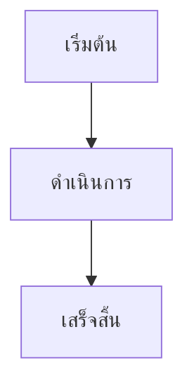

# 🎨 Mermaid Integration System for Chonost

ระบบไดอะแกรม Mermaid ที่เชื่อมโยงกับ Editor และ Whiteboard แบบไดนามิก พร้อม AI-powered Diagram Generation

## 🚀 Features หลัก

### 1. AI-Powered Diagram Generation
- **Text-to-Diagram**: แปลงข้อความเป็นไดอะแกรมด้วย AI
- **Smart Templates**: เทมเพลตอัตโนมัติสำหรับประเภทไดอะแกรมต่างๆ
- **Natural Language Processing**: เข้าใจคำสั่งภาษาไทยและอังกฤษ
- **Real-time Generation**: สร้างไดอะแกรมแบบ Real-time

### 2. Dynamic Editor Integration
- **Inline Editing**: แก้ไขไดอะแกรมในตัว Editor
- **Live Preview**: ดูตัวอย่างไดอะแกรมแบบ Real-time
- **Code Synchronization**: ซิงค์โค้ด Mermaid กับ Editor
- **Version Control**: เก็บประวัติการแก้ไข

### 3. Whiteboard Collaboration
- **Interactive Whiteboard**: ไวท์บอร์ดแบบโต้ตอบ
- **Real-time Collaboration**: ทำงานร่วมกันแบบ Real-time
- **Multi-user Support**: รองรับผู้ใช้หลายคน
- **Live Cursor**: แสดงตำแหน่งผู้ใช้อื่นๆ

## 📊 ประเภทไดอะแกรมที่รองรับ

### 1. Flowchart (แผนผังการทำงาน)


### 2. Sequence Diagram (ลำดับการทำงาน)


### 3. Class Diagram (โครงสร้างคลาส)
```mermaid
classDiagram
    class Character {
        +String name
        +String description
        +List~String~ traits
        +addTrait(trait)
        +removeTrait(trait)
    }
    
    class Story {
        +String title
        +String plot
        +List~Character~ characters
        +addCharacter(character)
    }
    
    Character ||--o{ Story : appears in
```

### 4. State Diagram (สถานะต่างๆ)


### 5. Entity Relationship (ความสัมพันธ์ข้อมูล)


### 6. User Journey (การเดินทางของผู้ใช้)


### 7. Gantt Chart (ตารางเวลา)


### 8. Pie Chart (กราฟวงกลม)


## 🤖 AI Integration Features

### 1. Natural Language Processing
```javascript
// ตัวอย่างการใช้งาน
const prompt = "สร้างแผนผังการเขียนนิยาย ตั้งแต่การวางแผนจนถึงการเผยแพร่";
const diagram = await aiGenerateDiagram(prompt, 'flowchart');
```

### 2. Smart Template Selection
- **Automatic Detection**: ตรวจจับประเภทไดอะแกรมที่เหมาะสม
- **Context Awareness**: เข้าใจบริบทของเนื้อหา
- **Custom Templates**: เทมเพลตที่ปรับแต่งได้

### 3. Real-time Generation
```javascript
// Real-time diagram generation
const generateDiagram = async (prompt, type) => {
  setIsGenerating(true);
  try {
    const response = await aiService.generateDiagram(prompt, type);
    setDiagram(response);
  } finally {
    setIsGenerating(false);
  }
};
```

## 🔗 Editor Integration

### 1. Inline Mermaid Blocks
```markdown
# เอกสารของฉัน

นี่คือเนื้อหาปกติ



และเนื้อหาต่อไป
```

### 2. Live Preview Mode
- **Split View**: แสดงโค้ดและตัวอย่างพร้อมกัน
- **Auto-save**: บันทึกอัตโนมัติ
- **Error Highlighting**: แสดงข้อผิดพลาดแบบ Real-time

### 3. Code Synchronization
```javascript
// Sync between editor and diagram
const syncDiagram = (code) => {
  updateEditor(code);
  updatePreview(code);
  saveToHistory(code);
};
```

## 🎨 Whiteboard Features

### 1. Interactive Canvas
- **Drag & Drop**: ลากวางองค์ประกอบ
- **Resize**: ปรับขนาดไดอะแกรม
- **Zoom**: ซูมเข้า-ออก
- **Pan**: เลื่อนดูพื้นที่

### 2. Real-time Collaboration
```javascript
// WebSocket connection for real-time updates
const socket = new WebSocket('ws://localhost:3000/whiteboard');

socket.onmessage = (event) => {
  const update = JSON.parse(event.data);
  applyUpdate(update);
};
```

### 3. Multi-user Support
- **Live Cursors**: แสดงตำแหน่งผู้ใช้อื่นๆ
- **User Presence**: แสดงผู้ใช้ที่ออนไลน์
- **Conflict Resolution**: แก้ไขความขัดแย้ง

## 📱 Responsive Design

### 1. Mobile Support
- **Touch Gestures**: รองรับการสัมผัส
- **Adaptive Layout**: ปรับเลย์เอาต์ตามหน้าจอ
- **Offline Mode**: ทำงานแบบออฟไลน์

### 2. Tablet Optimization
- **Pen Support**: รองรับปากกาสไตลัส
- **Multi-touch**: รองรับการสัมผัสหลายจุด
- **Split Screen**: แบ่งหน้าจอ

## 🔧 API Integration

### 1. REST API Endpoints
```javascript
// Diagram Management
GET    /api/diagrams              // ดึงรายการไดอะแกรม
POST   /api/diagrams              // สร้างไดอะแกรมใหม่
GET    /api/diagrams/:id          // ดึงไดอะแกรม
PUT    /api/diagrams/:id          // อัปเดตไดอะแกรม
DELETE /api/diagrams/:id          // ลบไดอะแกรม

// AI Generation
POST   /api/ai/generate-diagram   // สร้างไดอะแกรมด้วย AI
POST   /api/ai/optimize-diagram   // ปรับปรุงไดอะแกรม

// Collaboration
POST   /api/whiteboard/join       // เข้าร่วมไวท์บอร์ด
POST   /api/whiteboard/update     // อัปเดตไวท์บอร์ด
```

### 2. WebSocket Events
```javascript
// Real-time events
'user-joined'     // ผู้ใช้เข้าร่วม
'user-left'       // ผู้ใช้ออกจาก
'diagram-updated' // ไดอะแกรมอัปเดต
'cursor-moved'    // เคอร์เซอร์เคลื่อนที่
```

## 🎯 Use Cases

### 1. การเขียนนิยาย
- **Character Relationships**: แสดงความสัมพันธ์ตัวละคร
- **Plot Structure**: โครงสร้างพล็อต
- **Timeline**: ไทม์ไลน์ของเรื่อง
- **World Building**: สร้างโลกในนิยาย

### 2. การวางแผนโปรเจกต์
- **Project Timeline**: ไทม์ไลน์โปรเจกต์
- **Task Dependencies**: ความสัมพันธ์งาน
- **Resource Allocation**: การจัดสรรทรัพยากร
- **Progress Tracking**: ติดตามความคืบหน้า

### 3. การออกแบบระบบ
- **System Architecture**: สถาปัตยกรรมระบบ
- **Data Flow**: การไหลของข้อมูล
- **User Interface**: อินเทอร์เฟซผู้ใช้
- **Database Schema**: โครงสร้างฐานข้อมูล

## 🚀 Future Enhancements

### 1. Advanced AI Features
- [ ] **Voice-to-Diagram**: แปลงเสียงเป็นไดอะแกรม
- [ ] **Image Recognition**: รู้จำไดอะแกรมจากรูปภาพ
- [ ] **Smart Suggestions**: คำแนะนำอัจฉริยะ
- [ ] **Auto-optimization**: ปรับปรุงอัตโนมัติ

### 2. Enhanced Collaboration
- [ ] **Video Conferencing**: การประชุมผ่านวิดีโอ
- [ ] **Screen Sharing**: แชร์หน้าจอ
- [ ] **Recording**: บันทึกการทำงาน
- [ ] **Export Options**: ตัวเลือกการส่งออก

### 3. Integration Extensions
- [ ] **Third-party Tools**: เครื่องมือภายนอก
- [ ] **Plugin System**: ระบบปลั๊กอิน
- [ ] **API Marketplace**: ตลาด API
- [ ] **Custom Themes**: ธีมที่ปรับแต่งได้

## 📚 Documentation

### 1. Getting Started
```bash
# ติดตั้ง dependencies
npm install mermaid @iconify/react

# Import components
import { MermaidSystem, AIDiagramGenerator } from './MermaidSystem';
```

### 2. Basic Usage
```jsx
// ใช้งานระบบ Mermaid
<MermaidSystem />

// สร้างไดอะแกรมด้วย AI
<AIDiagramGenerator onGenerate={handleGenerate} />

// แสดงไดอะแกรม
<MermaidDiagram code={diagramCode} />
```

### 3. Advanced Configuration
```javascript
// ตั้งค่า Mermaid
mermaid.initialize({
  startOnLoad: true,
  theme: 'default',
  securityLevel: 'loose',
  fontFamily: 'Noto Sans Thai, sans-serif'
});
```

## 🎨 Customization

### 1. Themes
```css
/* Custom theme */
.mermaid-custom-theme {
  --primary-color: #5D5CDE;
  --secondary-color: #8B5FBF;
  --accent-color: #FF6B9D;
  --background-color: #FFFFFF;
  --text-color: #374151;
}
```

### 2. Animations
```css
/* Custom animations */
.diagram-enter {
  animation: slideInUp 0.3s ease-out;
}

.diagram-exit {
  animation: slideOutDown 0.3s ease-in;
}
```

### 3. Responsive Breakpoints
```css
/* Mobile first approach */
@media (max-width: 768px) {
  .mermaid-container {
    font-size: 12px;
  }
}

@media (min-width: 1024px) {
  .mermaid-container {
    font-size: 16px;
  }
}
```

---

*ระบบ Mermaid Integration นี้ถูกออกแบบมาเพื่อให้ Chonost มีความสามารถในการสร้างและจัดการไดอะแกรมที่ครบครัน พร้อมรองรับการทำงานร่วมกันแบบ Real-time และการใช้งาน AI เพื่อเพิ่มประสิทธิภาพในการทำงาน*
