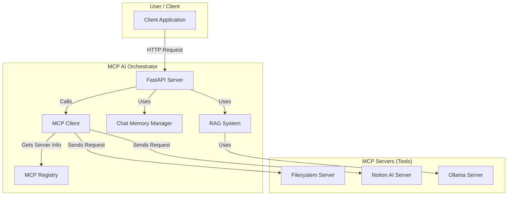
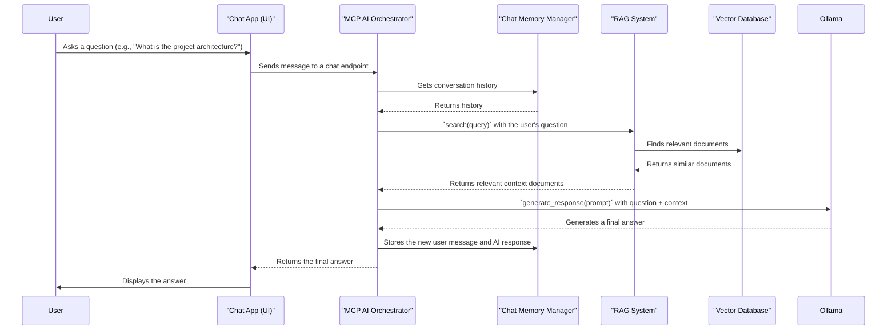

# System Architecture

This document provides a high-level overview of the MCP (Modular Component Protocol) AI Orchestrator system architecture.

## Core Components

The system is built around a few core components that work together to provide a flexible and extensible platform for AI-powered tools.

- **FastAPI Server (`main.py`):** The main entry point for the orchestrator. It exposes a RESTful API for interacting with the MCP ecosystem.
- **MCP Registry (`mcp/registry.py`):** A central registry for discovering and managing available MCP servers. Each server represents a connection to a tool or a set of tools (e.g., file system, database, external API).
- **MCP Client (`mcp/client.py`):** A unified client for communicating with MCP servers. It handles the different transport protocols (stdio, http, docker, etc.) required to interact with each server.
- **Chat Memory Manager (`memory/chat_memory_manager.py`):** A persistent storage system for chat conversations, using a SQLite database. It allows AI agents to maintain context over long conversations.
- **RAG System (`core/rag_system.py`):** The Retrieval-Augmented Generation system. It uses a vector database to store and retrieve documents, providing relevant context to the LLM for generating responses.

## High-Level Flow Diagram

The following diagram illustrates the basic flow of a tool call through the system.

## Detailed Workflow: `/mcp/call`

1.  A client sends a POST request to the `/mcp/call` endpoint with a `tool_name` and `parameters`.
2.  The **FastAPI Server** receives the request.
3.  The server uses the unified **MCP Client** to handle the request.
4.  The **MCP Client** parses the `tool_name` (e.g., `filesystem.semantic_search`) to determine the target server (`filesystem`).
5.  It queries the **MCP Registry** to get the connection details for the `filesystem` server.
6.  The **MCP Client** uses the appropriate transport (e.g., `ProcessTransport`) to send the tool call request to the target **MCP Server**.
7.  The **MCP Server** executes the tool and returns the result.
8.  The result is propagated back through the chain to the client.

---

## Sequence Diagram: AI-Powered Search

This diagram shows the sequence of interactions for a common use case: a user asking a question that requires the RAG system.

## Service Flow Example: Onboarding a New Document

This example describes the flow of how a new document is processed and added to the knowledge base.

1.  **File Watcher:** A file watcher service (e.g., `services/file-watcher/file_watcher.py` or `core-services/link-ai-core/core/auto_vault_watcher.py`) detects a new or modified document in the target directory.
2.  **Trigger Orchestrator:** The watcher calls an endpoint on the **MCP AI Orchestrator** (e.g., a hypothetical `/documents/process` endpoint).
3.  **Document Processing:** The Orchestrator uses the `DocumentProcessor` from the **RAG System** to clean the document content and split it into manageable chunks.
4.  **Embedding Generation:** For each chunk, the Orchestrator calls the `EmbeddingProvider` (e.g., using Ollama) to generate a vector embedding.
5.  **Storage in Vector DB:** The Orchestrator instructs the **RAG System** to store each document chunk and its corresponding embedding in the **Vector Database** (e.g., ChromaDB).
6.  **Indexing:** The Vector Database indexes the new vectors, making them available for future searches.
7.  **Confirmation:** The Orchestrator returns a confirmation that the document has been successfully processed and indexed.
