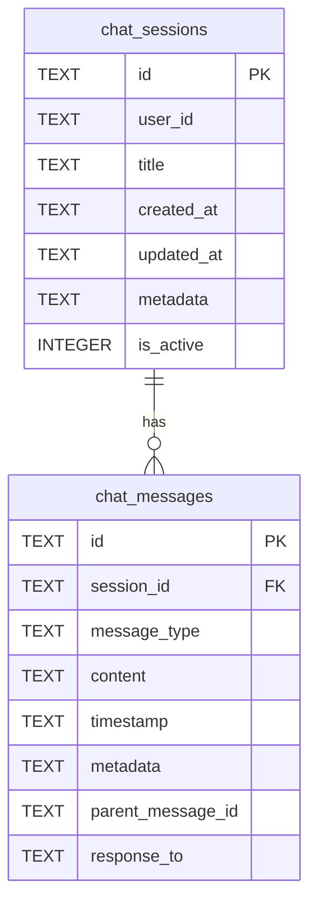

# Database Schema

This document describes the database schema for the `chat_memory.db` SQLite database, which is managed by the `ChatMemoryManager`.

## Overview

The database is designed to store chat conversations, including session information and individual messages. It consists of two main tables: `chat_sessions` and `chat_messages`.

---

## Tables

### `chat_sessions`

This table stores information about each chat session.

| Column      | Type    | Description                                                 |
|-------------|---------|-------------------------------------------------------------|
| `id`          | `TEXT`  | **Primary Key.** A unique identifier for the session (UUID).    |
| `user_id`     | `TEXT`  | The ID of the user who initiated the session.               |
| `title`       | `TEXT`  | The title of the chat session.                              |
| `created_at`  | `TEXT`  | The ISO 8601 timestamp when the session was created.        |
| `updated_at`  | `TEXT`  | The ISO 8601 timestamp when the session was last updated.   |
| `metadata`    | `TEXT`  | A JSON string for storing any additional metadata.          |
| `is_active`   | `INTEGER` | A boolean flag (0 or 1) indicating if the session is active. |

**Indexes:**
- `idx_session_user` on `(user_id)`
- `idx_session_active` on `(is_active)`

---

### `chat_messages`

This table stores the individual messages within each chat session.

| Column              | Type    | Description                                                            |
|---------------------|---------|------------------------------------------------------------------------|
| `id`                  | `TEXT`  | **Primary Key.** A unique identifier for the message (UUID).             |
| `session_id`          | `TEXT`  | **Foreign Key** to `chat_sessions.id`. The session this message belongs to. |
| `message_type`        | `TEXT`  | The type of message (e.g., 'user', 'ai', 'system'). See `MessageType` enum. |
| `content`             | `TEXT`  | The content of the message.                                            |
| `timestamp`           | `TEXT`  | The ISO 8601 timestamp when the message was created.                   |
| `metadata`            | `TEXT`  | A JSON string for storing any additional metadata.                     |
| `parent_message_id`   | `TEXT`  | The ID of the parent message in a threaded conversation (optional).      |
| `response_to`         | `TEXT`  | The ID of the message that this message is a response to (optional).     |

**Indexes:**
- `idx_message_session` on `(session_id)`
- `idx_message_timestamp` on `(timestamp)`

---

## Entity-Relationship Diagram (ERD)

The following diagram illustrates the relationship between the tables.

